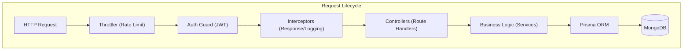

# CareerPulse Backend - Enterprise Job Portal API

[](https://nestjs.com/)
[](https://www.prisma.io/)
[](https://www.mongodb.com/)
[](https://docs.nestjs.com/security/throttler)

A robust, enterprise-grade RESTful API powering the CareerPulse Job Portal. Built with **NestJS 11**, this backend emphasizes security, scalability, and modular system design.

---

## 🏗️ Architectural Overview

The system is built on a **Modular Hexagonal-inspired Architecture**, ensuring strict separation of concerns and high maintainability.



---

## 🛡️ Enterprise Security Hardening

As a production-ready system, CareerPulse implements several critical security patterns:

- **Brute Force Mitigation:** Custom `BruteForceService` tracks login attempts and implements exponential backoff/blocking for suspicious IP/Email patterns.
- **JWT Rotation & Refresh:** Implements secure JWT handshakes with `accessToken` and `refreshToken` rotation to minimize session hijacking risks.
- **Multi-tiered Throttling:** Configured with `short` (high-frequency), `medium`, and `long` term rate limits to protect against DDoS and scraping.
- **Credential Safety:** Industry-standard password hashing using `bcrypt` and secure `HttpOnly` cookie management.
- **Input Validation:** Global `ValidationPipe` with strict white-listing to prevent SQL/NoSQL injection and data corruption.

---

## ✨ Core Features

- **Auth System:** Email verification flow, password recovery, and role-based access control (Student vs Recruiter).
- **Job Management:** Optimized relational queries for job postings, filtering, and application tracking.
- **Company Orchestration:** Unified management for recruiters to handle multiple companies.
- **Asynchronous Workflows:** Integrated `EmailService` for non-blocking notifications.
- **Monitoring:** Systematic use of the NestJS `Logger` for comprehensive system auditing and error tracking.

---

## 🛠️ Tech Stack

- **Framework:** NestJS 11 (Node.js)
- **Database:** MongoDB
- **ORM:** Prisma
- **Auth:** Passport.js + JWT
- **Documentation:** Swagger UI (OpenAPI 3.0)
- **Testing:** Jest + Supertest (Unit & E2E)

---

## 🚀 Getting Started

### Prerequisites
- Node.js 20+
- MongoDB instance (Atlas or Local)
- Docker (Optional)

### Environment Setup
Create a `.env` file in the root:
```env
DATABASE_URL="mongodb+srv://..."
JWT_SECRET="your-super-secret"
JWT_REFRESH_SECRET="another-secret"
PORT=3000
NODE_ENV=development
```

### Installation
```bash
# Install dependencies
npm install

# Generate Prisma Client
npx prisma generate

# Start development
npm run start:dev
```

### API Documentation
Once running, visit: `http://localhost:3000/api/docs` to view the comprehensive Swagger documentation.

---

## 🐳 Docker Deployment

Full orchestration is available via Docker Compose:
```bash
docker-compose up --build
```

---

## 📝 License
This project is [UNLICENSED](LICENSE).
